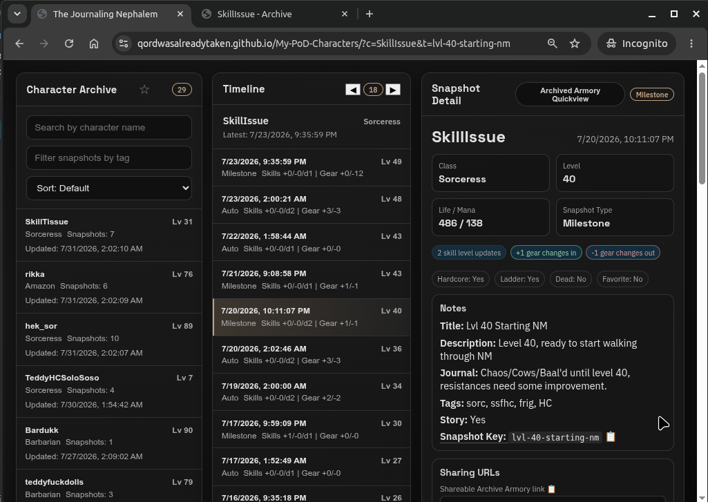
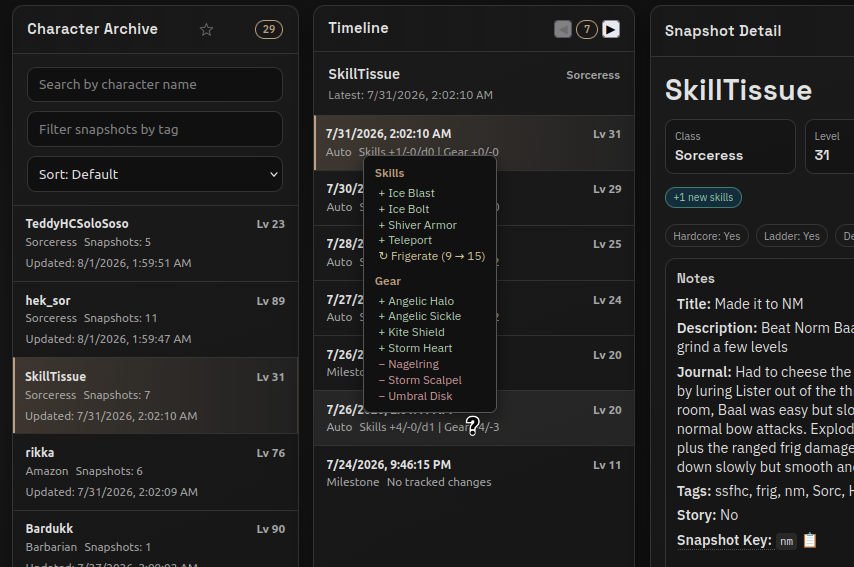
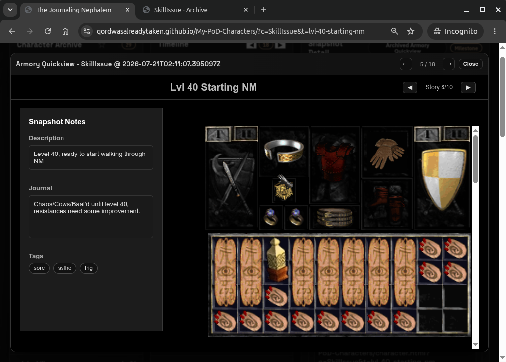
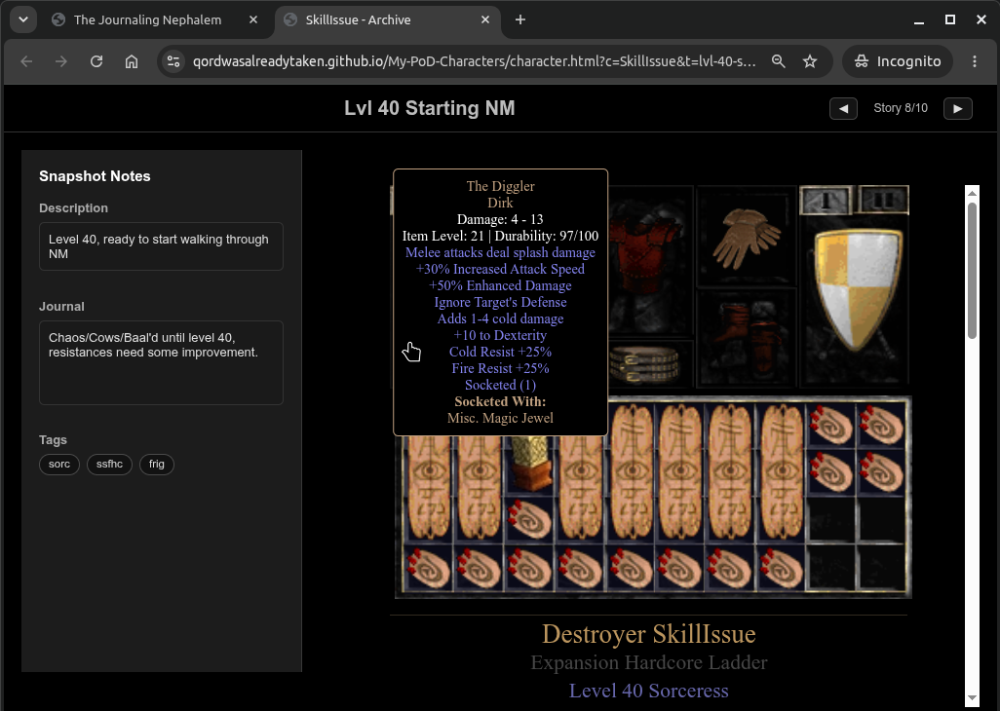

# Readme Under Construction

# The Journaling Nephalem

Capture your Path of Diablo journey one snapshot at a time.

The Journaling Nephalem is a character archive that automatically records snapshots of your Path of Diablo characters. Track equipment upgrades, level progression, skills, and personal milestones throughout a season, then preserve your character's history long after the ladder resets.

Unlike a traditional armory, The Journaling Nephalem lets you tell the story of your character. Add journal entries, tag memorable moments, mark favorite snapshots, and browse exactly how your build evolved over time.

> Every hero has a story. Don't let yours disappear at ladder reset.

---

## Features

- Automatic character snapshots (once a day by default)
- Journal entries for memorable moments or note taking
- "Favorite" ⭐ important snapshots
- Custom tags for organization (class and HC tags added by default)
- Interactive armory viewer
- Browse every snapshot from a searchable timeline
- Track equipment and skill changes between snapshots
- Story mode for navigating milestone snapshots
- JSON-based archive that's easy to back up or modify

## Screenshots

### Dashboard

Dashboard with list of characters, snapshots, and details about the selected snapshot

Quickly see what changed from the previous snapshot

### Armory

Armory Quickview allows you to quickly move through all of a characters snapshot armory pages

Familiar, shareable Armory view that includes snapshot notes & details, and optional Story navigation

## Why?

Every Path of Diablo ladder eventually ends.

Characters disappear from the official armory, memories fade, and the story of that gear progression is gone forever.

The Journaling Nephalem solves that problem by keeping your own permanent archive. Every snapshot becomes part of your character's history, allowing you to look back at your journey months or even years later.

## Quick Start

1. Fork this repo.
2. Enable GitHub Actions.
3. Add your character names.
4. Run the initial snapshot workflow.
5. Enable the scheduled workflow.
6. Visit your GitHub Pages site.

That's it.

## Adding Characters

You can add characters:
- One at a time by simply creating manual snapshots for each of them by running the  Create Milestone Snapshot workflow
- In bulk by editing the watched_characters.json to include character names and running the Daily All Character Snapshots workflow

## Video Walkthrough

Prefer a guided setup?

Watch the complete walkthrough covering GitHub Actions, milestones, and navigating the dashboard.

*Audio issues on the first video made it kinda suck, need to record a new one*

## How It Works

The Journaling Nephalem is entirely powered by GitHub.

GitHub Actions periodically check your characters for changes. Snapshots are only saved when something has changed, preventing duplicate entries while still preserving your character's progression. Each new snapshot is committed to your repository, and GitHub Pages automatically publishes an updated dashboard.

Because everything is stored in your own repository:

- Your archive is permanent.
- No database or web server is required.
- The entire site can be hosted for free using GitHub Pages.

Since this is driven by character names, reusing character names adds to any existing character history.

## Creating Milestones

Automatic snapshots are great for recording your character's progression, but not every moment is equally memorable.

Milestone snapshots let you capture the moments that matter.

Examples include:

- Capturing a moment in time to feature in a build guide
- Finding your first Cham (arguably the best rune, fight me!)
- Completing your endgame build
- Your Diablo Clone build
- Reaching level 99
- Beginning a new build
- Regrettable Respec's

Milestones can include:

- Custom title
- Description
- Journal entry
- Tags for easy filtering/sorting
- Favorite status
- Story marker

Milestones, or manual snapshots, are created using the Create Milestone Snapshot workflow in GitHub Actions. 

## Story Snapshots

Mark any milestone as part of your character's story.

The armory includes Story Navigation, allowing you to jump directly between important milestones while skipping routine or automatic snapshots.

This creates a curated timeline of your character's journey.

## Editing Existing Snapshots

You can edit all details of any existing snapshots using the Edit Existing Snapshot workflow

## Deleting Characters

You can completely remove a character by running the Delete Character workflow

## Only a few Purposeful Github Actions

| Workflow                      | Purpose                                                                           |
| ----------------------------- | --------------------------------------------------------------------------------- |
| Create Milestone Snapshot     | Create a manual snapshot with optional journal entries, tags, and story metadata  |
| Edit Snapshot                 | Edit/Update the metadata of an existing snapshot                                       |
| Delete Character              | Remove a character and its archived snapshots                                     |
| Daily All Characters Snapshot | Check every tracked character and create snapshots only when changes are detected |

---

Questions and suggestions are always welcome.

